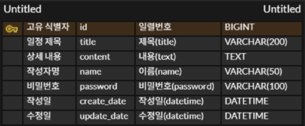

# 일정 관리 앱 만들기
## ERD


## API 명세서 작성
Base URL : http://localhost:8080/schedule

### 1. 일정 생성
새로운 일정을 등록한다.
- URL : ```/schedules```
- Endpoint : ```/schedules```
- Method : ```POST```

| name     | type   | Required | Description    |
|----------|--------| --- |----------------|
| title    | String | ✅ | 일정 제목          |
| content  | String | ❌ | 일정 상세 내용       |
| name     | String | ✅ | 작성한 사람의 이름     |
| password | String | ✅ | 비밀번호           |
| createDate | String | ✅ | 작성일 |
| updateDate | String | ✅ | 수정일(최초 작성 시 작성일과 수정일 동일) |

**작성일과 수정일은 서버에서 자동으로 생성**

#### Request Body
```
{
    "title" : "일정 제목",
    "content" : "일정 상세 내용",
    "name" : "작성자명",
    "password" : "1234",
}
```

#### Response body
응답 코드 : ```201 created```
```
{
    "title" : "일정 제목",
    "content" : "일정 상세 내용",
    "name" : "작성자명",
    "createDate" : "작성일",
    "updateDate" : "수정일"
}
```

### 일정 전체 조회
일정을 작성자명 기준으로 전부 조회한다.
- URL : ```/schedules?name = 작성자명```
- Endpoint : ```/schedules```
- Method : ```GET```

| name     | type   | Required | Description    |
|----------|--------| --- |----------------|
| title    | String | ✅ | 일정 제목          |
| content  | String | ✅ | 일정 상세 내용       |
| name     | String | ❌ | 작성한 사람의 이름     |
| password | String | ✅ | 비밀번호           |
| createDate | String | ✅ | 작성일 |
| updateDate | String | ✅ | 수정일 |

#### Request Body
```
none
```

#### Response body
응답 코드 : ```200 ok```
```
[
    {
        "id" : 1,
        "title" : "일정 제목",
        "content" : "일정 상세 내용",
        "name" : "작성자명A",
        "createDate" : "작성일",
        "updateDate" : "수정일"
    },
    
    {
    "id" : 2,
    "title" : "일정 제목",
    "content" : "일정 상세 내용",
    "name" : "작성자명A",
    "createDate" : "작성일",
    "updateDate" : "수정일"
    }
]    
```

### 일정 단 건 조회
일정을 단 건 조회한다.
- URL : ```/schedules/{Id}```
- Endpoint : ```/schedules/{Id}```
- Method : ```GET```

| name     | type   | Required | Description    |
|----------|--------| --- |----------------|
| title    | String | ✅ | 일정 제목          |
| content  | String | ✅ | 일정 상세 내용       |
| name     | String | ✅ | 작성한 사람의 이름     |
| password | String | ✅ | 비밀번호           |
| createDate | Sstring | ✅ | 작성일 |
| updateDate | String | ✅ | 수정일 |

| Path Variable | type | Description |
| --- | --- | --- |
| id | number | 수정할 일정의 고유 ID |

#### Request Body
```
none
```

#### Response body
응답 코드 : ```200 ok```
```
{
    "id" : 1,
    "title" : "일정 제목",
    "content" : "일정 상세 내용",
    "name" : "작성자명",
    "createDate" : "작성일",
    "updateDate" : "수정일"
}
```

### 일정 수정
선택한 일정 내용 중 일정 제목, 작서자명만 수정한다.
- URL : ```/schedules/{id}```
- Endpoint : ```/schedules/{Id}```
- Method : ```PATCH```

| name   | type | Required | Description |
|--------| --- | --- | --- |
| title  | String | ✅ | 일정 제목 |
| name   | String | ❌ | 작성한 사람의 이름 |

| Path Variable | type | Description |
| --- | --- | --- |
| id | number | 수정할 일정의 고유 ID |

#### Request Body
```
{
    "title" : "수정된 일정 제목",
    "name" : "수정된 작성자명",
}    
```

#### Response body
응답 코드 : ```200 ok```
```
{
    "id" : 1,
    "title" : "수정된 일정 제목",
    "content" : "일정 상세 정보",
    "name" : "수정된 작성자명",
    "createDate" : "작성일",
    "updateDate" : "수정일"
}
```

### 일정 삭제
비밃번호 검증 후 선택한 일정을 삭제한다.
- URL : ```/schedules/{id}```
- Endpoint : ```/schedules/{Id}```
- Method : ```DELETE```

| name     | type   | Required | Description |
|----------|--------| --- |-------------|
| password | String | ✅ | 삭제할 일정의 pw  |

| Path Variable | type | Description |
| --- | --- | --- |
| id | number | 수정할 일정의 고유 ID |

#### Request Body
```
{
    "password" : "1234"
}
```

#### Response body
응답 코드 : ```204 No Content```
```
none
```